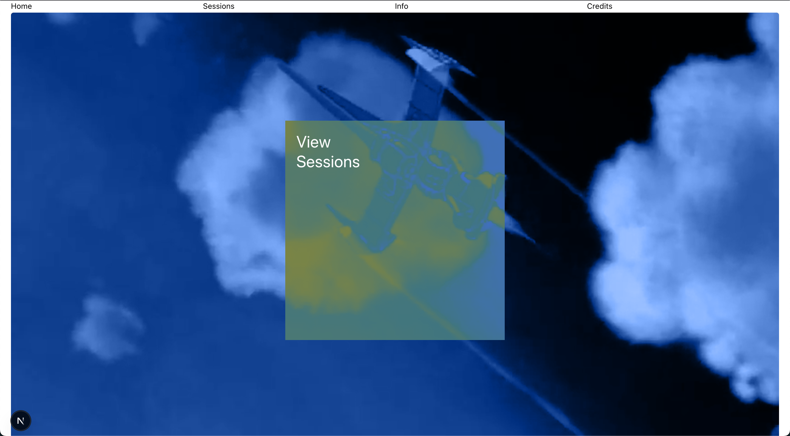
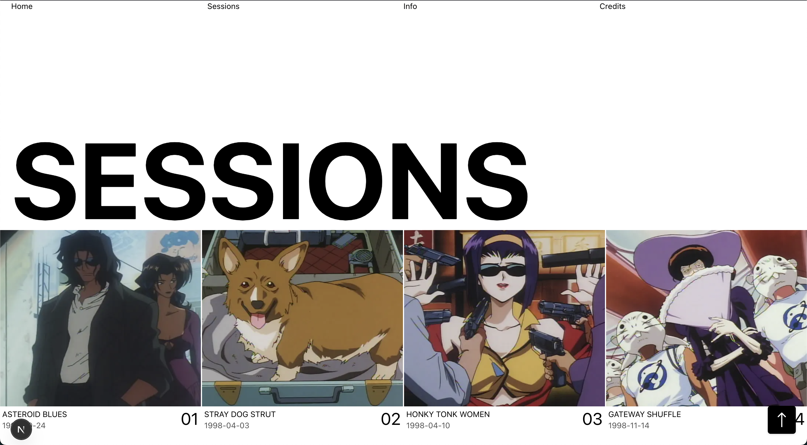
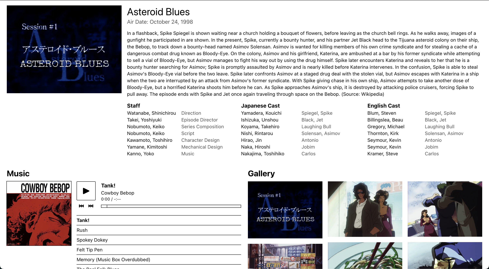

# Radical Tomato (RT)

This is a fun R&D project made to practice web layouts as well as RESTful APIs.

Layouts are inspired by both [Line Animation Studio](https://thelinestudio.com/work/cowboy-bebop) for the Home page, and [Sturdy](https://sturdy.co/) for the Session(s) page(s).

Content is populated using the [Cowboy Bebop Fanpage](https://cowboybebop.fandom.com/wiki/Main_Page) via the [Wikipedia API](https://www.mediawiki.org/wiki/API:Main_page), the [Jikan API](https://docs.api.jikan.moe/), and the Cowboy Bebop OST Collection via the [Internet Archive](https://archive.org/details/Cowboy-Bebop-OST-Collection).

## Things to fix

- Session - header font size responsiveness
- ~~Home page video optimization (Mux? Blob?)~~
- ~~Session - fix display for staff with multiple positions (?)~~
- Session - small music player bugs
- Main session button backdrop blur Safari/Firefox (?)

## Todo

- ~~Session - add buttons for prev / next episode~~
- ~~Sessions - scroll to top visibility animation~~

## Future plans

- Animations (?)
- Gallery lightbox
- ~~Remove next-view-transitions (?)~~

